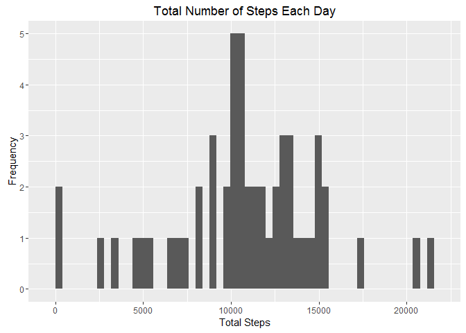
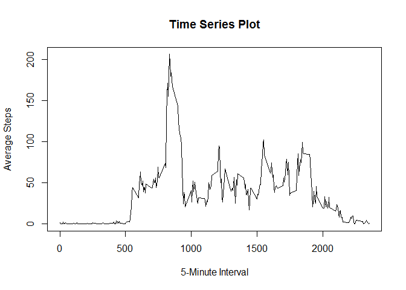
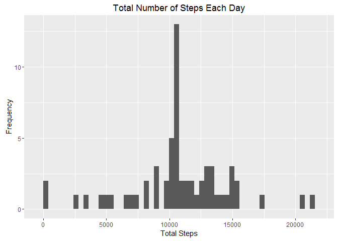
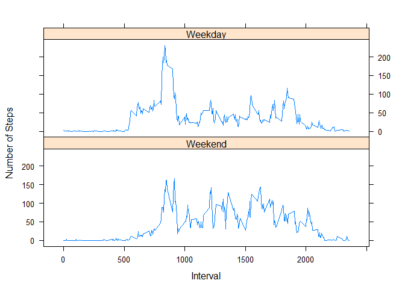

# Reproducible Research: Peer Assessment 1


## Loading and preprocessing the data
Data is in the current working directory as a zip file
We will extract the activity.csv file and load it to a data frame.

```r
  ##Unzip the activity.zip file in the current directory
  unzip("activity.zip", "activity.csv")
  ##Load the csv file
  df <- read.csv("activity.csv")
```

Check on the dataset shows that it has 3 columns: steps, date, and interval. The date field is a factor. Lets convert that to Date class for future analysis

```r
  ##Convert the date to class Date
  df$date <- as.Date(df$date)
```

Load the libraries to be used here:

```r
  library(dplyr)
```

```
## Warning: package 'dplyr' was built under R version 3.2.3
```

```
## 
## Attaching package: 'dplyr'
## 
## The following objects are masked from 'package:stats':
## 
##     filter, lag
## 
## The following objects are masked from 'package:base':
## 
##     intersect, setdiff, setequal, union
```

```r
  library(ggplot2)
```

```
## Warning: package 'ggplot2' was built under R version 3.2.3
```

```r
  library(lattice)
```

## What is mean total number of steps taken per day?
We will use the subset of the data without any NA's for this section

First. find the total number fo steps taken per day. To find this, we
group the data by date and take a sum of all the steps

```r
  ##Remove all the NA from the dataset and calcualte the total
  ##steps taken each day
  dfSteps <- na.omit(df) %>% 
    select(steps,date) %>% 
    group_by(date) %>%
    summarise(sum=sum(steps))
```

Now, we will plot a histogram of the total number of steps taken per day.
x-axis is the number of steps; y-axis is the Frequency of that count


```r
  ##Build a frequency count of the Total steps
  ##I set the bins to equal the number of rows in the dataset
  qplot(dfSteps$sum, bins=53,  ylab="Frequency", xlab="Total Steps", main="Total Number of Steps Each Day")
```

 

What is the Mean and Median values of the total steps taken per day?

```r
  ##Total Mean and Median of total number of steps taken each day
  print(paste("Mean of total number of steps per day:", as.integer(mean(dfSteps$sum))))
```

```
## [1] "Mean of total number of steps per day: 10766"
```

```r
  print(paste("Median of total number of steps per day:", as.integer(median(dfSteps$sum))))
```

```
## [1] "Median of total number of steps per day: 10765"
```


## What is the average daily activity pattern?
To study the daily activity pattern, lets create a timeseries plot
of 5-minute interval on x-axis and average number of steps taken averaged
across all days.

For this we will first remove all the NA's. Group data by interval. This plot shows us average steps taken per interval on all the reported days.


```r
  ##Remove all NA
  noNA <- na.omit(df)
  ##Subset Data to calcualte the average steps across all dates
  dfTS <- noNA %>% 
          select(steps,date, interval) %>% 
          group_by( interval) %>%
          summarise(avg=mean(steps))
  ##Plot Interval and Average Steps
  plot(dfTS$interval, dfTS$avg, type="l", xlab="5-Minute Interval", ylab="Average Steps", main="Time Series Plot")
```

 

Which interval contains the maximum number of steps? 
This should be the higest peak in the plot about. By calculating the maximum number of steps the interval is found to be at 835. Around 835
the plot should show the higest peak.

```r
  ##Calculate the Interval at which the avereage steps were maximum
  dfRow <- dfTS[which(dfTS$avg==max(dfTS$avg)),]
  print(paste("Max Number of Steps", as.integer(max(dfTS$avg)), "found at Interval:",dfRow[,1]))
```

```
## [1] "Max Number of Steps 206 found at Interval: 835"
```


## Imputing missing values
Let's check how many rows are with missing values

```r
  na <- df[!complete.cases(df),]
  print(paste("Total number of rows with NAs:", count(na)))
```

```
## [1] "Total number of rows with NAs: 2304"
```

We will devise a strategy that will calculate the values and populate the missings values Let's use the "average steps from all days" per interval as the default value to populate.

```r
  ##Fill in mean of steps for missing values in first column
  #Capture all the rows with NA
  narows <- df[!complete.cases(df),]
  ##Build a ref table with value to repalce NA with - mean steps by interval
  refT <- tapply(noNA$steps, noNA$interval, mean)
  ##Build a data frame with the 2 columns interval and steps as value
  dfRef <- data.frame(interval=as.integer(row.names(refT)), steps=as.integer(refT))
```

Now, we have to create a new dataset that will have all NA's populated
from the dfRef table, and build one whole complete case dataset

```r
  ##Merge with narows so that now I get a column with values instead of NA's
  dfNew <- merge(dfRef,narows, by.x="interval", by.y="interval")
  
  ##Weed out the extra columns
  dfNew <- dfNew %>%
      select(steps=steps.x, date, interval) 

  ##Create a new dataset with all NA's popualted with values
  dfAll <- rbind(dfNew, noNA)
```

Sanity Check: make sure there are no NA's and also the total number of rows is
that as the original:17568

```r
##There should be no NA's
print(paste("Total number of rows with NAs:", count(dfAll[!complete.cases(dfAll),])))
```

```
## [1] "Total number of rows with NAs: 0"
```

```r
print(paste("Total number of rows:", count(dfAll)))
```

```
## [1] "Total number of rows: 17568"
```

How did the imputing of NA's affect the total number of steps?

```r
##make a histogram of the total number of steps taken each day
dfAllSteps <- dfAll %>% 
  select(steps,date) %>% 
  group_by(date) %>%
  summarise(sum=sum(steps))

qplot(dfAllSteps$sum, bins=53, ylab="Frequency", xlab="Total Steps", main="Total Number of Steps Each Day")
```

 

Interesting. The overall shape of histogram remains the same, but the frequency
count for some high steps went up. Did it affect the mean and median?

```r
print(paste("Mean of total number of steps per day:", as.integer(mean(dfAllSteps$sum))))
```

```
## [1] "Mean of total number of steps per day: 10749"
```

```r
print(paste("Median of total number of steps per day:", as.integer(median(dfAllSteps$sum))))
```

```
## [1] "Median of total number of steps per day: 10641"
```

Not by much. This makes sense because about 2000 rows were added, but the max value for each missing value was only 206, beacuse of the strategy adpoted. 

It did affect the frequency of total number of steps in the 10000 range.That makes me conclude that most of the missing values must have been around the interval where the total steps were in 10000 range. 

## Are there differences in activity patterns between weekdays and weekends?

Create a new variable "day" that indicates whether the given date is weekday or weekend

```r
  ##Logic to determine Weekend or Weekday
  weekend <- c("Sunday","Saturday")
  dfAll$day <- factor((weekdays(dfAll$date) %in% weekend), 
                           levels=c(TRUE, FALSE), labels=c('Weekend', 'Weekday'))
```

Make a timeseries plot of the interval and average steps per interval,
across the two regions: weekend and weekday

```r
  ##Make sure the interval is of integer type
   dfAll$interval <- as.integer(dfAll$interval)
  
  ##Find the mean across weekday or weekend
   dfStack <- dfAll %>% 
    select(steps,date, interval, day) %>% 
    group_by( day, interval) %>%
    summarise(avg=mean(steps))
   
  ##Plot the weekend and weekday stacked
  xyplot(avg ~ interval | day, data = dfStack, layout=c(1,2), type="l", xlab="Interval", ylab="Number of Steps")
```

 


